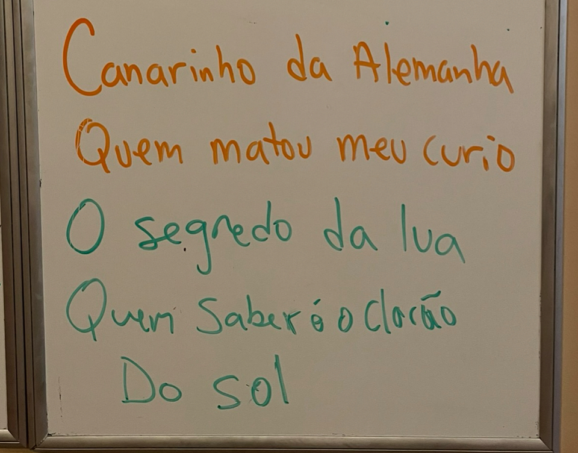

# Curio

Canarinho da Alemanha
Quem matou meu curio

Canarinho da Alemanha
Quem matou meu curio

Ê

**Canarinho da Alemanha**

**Quem matou meu curio**
**
**
**Canarinho da Alemanha**

**Quem matou meu curio**
**
**
Canarinho da Alemanha
Quem matou meu curio

O segredo de lua quem saberó o clarão de sol

Ê

**Canarinho da Alemanha**

**Quem matou meu curio**
**
**
**Canarinho da Alemanha**

**Quem matou meu curio**
**
**
Canarinho da Alemanha
Quem matou meu curio
**
**
Na roda de Capoeira, quero ver quem é melhor

Ê

**Canarinho da Alemanha**

**Quem matou meu curio**
**
**
**Canarinho da Alemanha**

**Quem matou meu curio**
**
**
Canarinho da Alemanha
Quem matou meu curio

Eu jogo capoeira, Mestre Pestinha/Bimba/Peixinho/Nô é o

Ê
**
**
**Canarinho da Alemanha**

**Quem matou meu curio**
**
**
**Canarinho da Alemanha**

**Quem matou meu curio**

the moon's secret who will know the sun's glare

